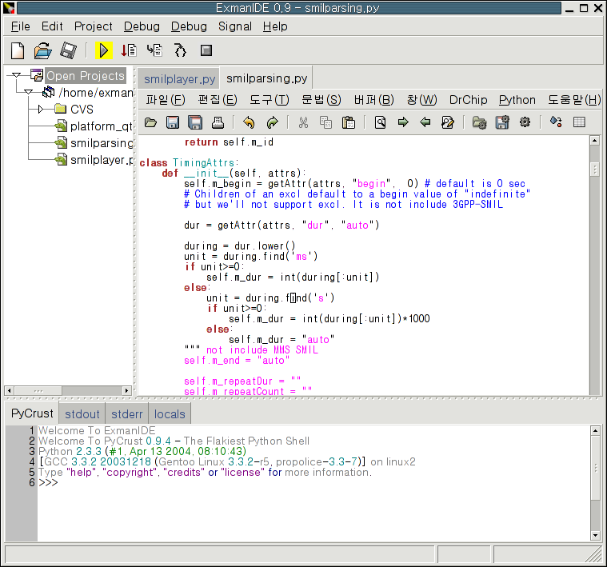

# ExmanIDE
The Python integrated development environment tool for X11/Linux. This program was developed between 2002 and 2004 in the CVS hosting space of kldp.net. The goal was to provide most of features that modern IDEs have, including a visual debugging and syntax highlighting for python 2.2/3. Additionally, patches were made to the X11 version of wxGTK which has been used for this IDE to enable Hangul(Korean) input and output. The patch for wxGTK can be found at http://kldp.net/exmanide/release/ as tarball. 

## Screenshots

